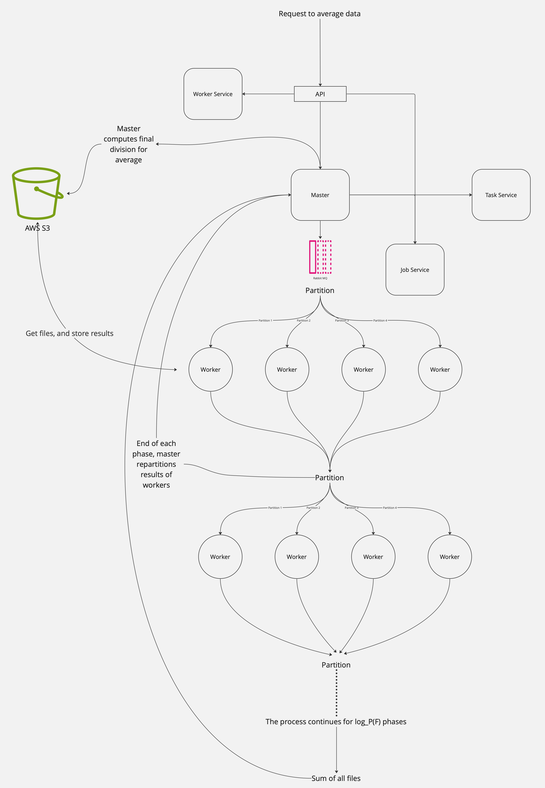

# Project Title: Distributed File Processing System

## Introduction

This project designs and implements a distributed system to process large computational jobs across a fleet of workers. The primary task is to compute the mean of every index across multiple files, each containing a set of random numbers.

Checkout the deployed version: [Distributed Sum](https://distributed.ephemeron.io)

## Features

- **Dynamic Worker Allocation:** Ability to spawn a user-defined number of worker processes (W).
- **File Processing:** Compute the mean across F files, each with C random numbers.
- **Resource Management:** Each worker can process a maximum of 5 files concurrently, ensuring efficient memory usage.
- **Queue Management:** Jobs are queued and processed asynchronously, allowing for multiple jobs to be submitted and processed in parallel.
- **Worker Orchestration:** Optimized to minimize worker idle time and handle varying processing speeds.
- **Real-Time Monitoring:** The UI displays live updates on the system's state, including worker status, job completion, and queue information through RabbitMQs management UI.

## Technology Stack

- **UI:** React with Javascript
- **API:** Node.js with Express and TypeScript
- **Worker Processes:** Python
- **Queue System:** RabbitMQ
- **Storage:** AWS S3

## Setup and Installation

### Prerequisites

- Node.js
- Python
- React

### Installation Steps

1. Clone the repository: `git clone [repo-link]`
2. Install dependencies for each component:
   - API: `cd api && npm install`
   - Worker: `cd worker && pip install -r requirements.txt`
   - UI: `cd ui && npm install`
3. Set up environment variables/config files as needed.
4. Run `docker build`, the UI will launch at `localhost:3000`

<!-- ## Usage

1. Start the API server: `cd api && npm start`
2. Launch worker processes: `cd worker && python worker.py`
3. Run the UI: `cd ui && npm start`
4. Access the UI through the browser at `localhost:3000`. -->

## Architecture

The services are hosted on DigitalOcean's Kubernetes service, utilizing three nodes. The API, upon receiving the desired number of workers from the user, spawns corresponding Kubernetes pods using the provided Docker file.

Upon receiving $F$ files for processing, the Master node divides them into tasks of size $P$, creating $F/P$ tasks. These tasks are then communicated to the worker nodes through a queue. Each worker node, upon receiving a task, processes its assigned file partition, computes the sum, and informs the Master of the file's location via an API call. This process repeats for $log_P(F)$ phases with partitions of sizes $F/P, F/P^2, ..., 1$, until only one final file is produced. The Master then calculates the final output, dividing the numbers in this file by the total number of files, and stores the result in S3. Note that all intermediate files are also stored in S3
.

To address variations in worker processing speeds and minimize idle time during each summation phase, a speculative execution strategy is employed. The Master maintains statistics on the average completion time for tasks and periodically reschedules tasks based on certain conditions:

The job is close to completion (over 75% of tasks are complete).
Some tasks have been running for longer than 1.2 times the average duration.
These criteria help ensure that worker nodes are fully utilized and that slower-performing tasks do not unduly delay a summation phase. The specific constants used in this strategy may require tuning to optimize system performance.

### The Choice of P

Given the RAM constraints, a straightforward choice for the partition size would be $P = 5$. However, this approach leads to the generation of a disproportionately high number of tasks at each level of our summation tree. To optimize, we can consider larger values of $P$, especially when we have more workers available. This adjustment is feasible if we modify the workers to sum only 5 files at a time from their assigned task.

For instance, if a worker $W$ is assigned a task $T = [F_1, ..., F_P]$ where $P > 5$, we can tackle RAM limitations by breaking down the task into smaller subtasks, each involving only 5 files. This method allows the worker $W$ to process a larger number of files per task by sequentially reading and summing sets of 5 files.

A potential downside to this approach lies in its interaction with our speculative execution strategy. If the number of files in a task is too large, there's a risk of substantial recomputation when a faster node takes over a task. Currently, our system does not support the utilization of partial results, which could mitigate this issue.

## Disclaimer

As is probably obvious from the looks of the UI, I am not a frontend engineer so I apologize for it's lack of flair and ugliness.

## Acknowledgments

Thanks to the creators of this takehome, it was quite interesting to think about and implement.